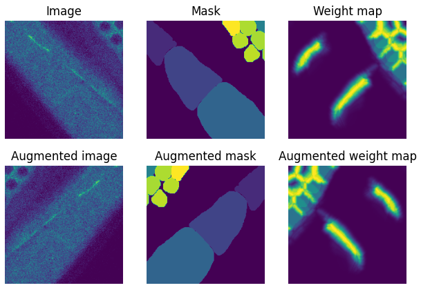
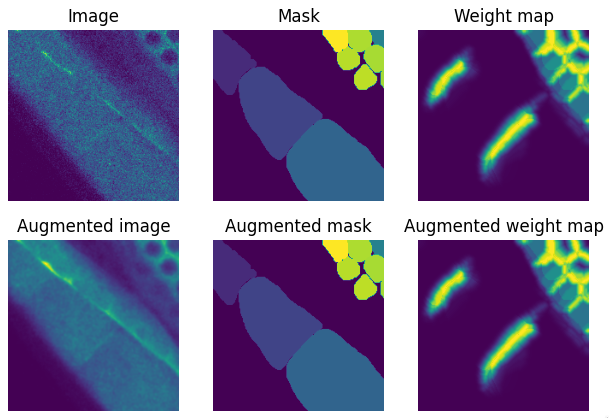
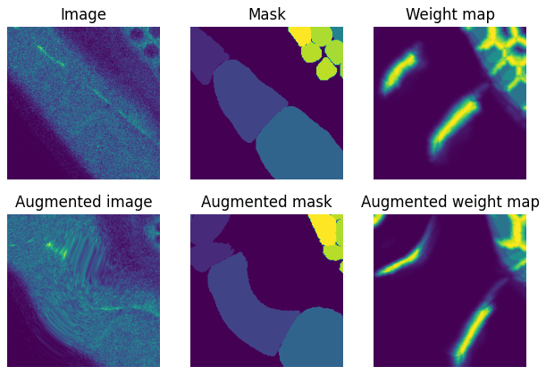
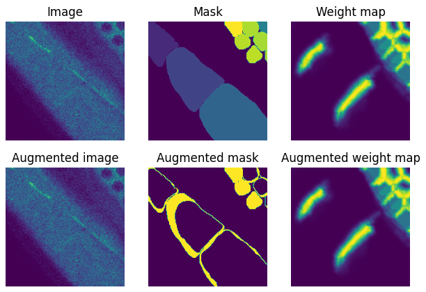
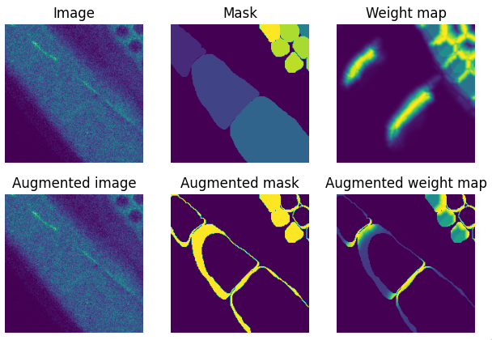

# albumentations_3d

`albumentations_3d` is an small augmentation library with an API similar to albumentations but with specific support for 3D images in segmentation-based tasks. This package allows for paired augmentations of `images`, `masks`, and `weight maps`.

Augmentations such as blur will **only** be applied to `image`. Augmentations such as `elastic_deform` will be applied to `image`, `mask` **and** `weight_map`.

This library was used in training a UNet edge detector for instance segmentation of the *C. elegans* germline, [found here](https://github.com/callum-jpg/UNet_3D_C_elegans).

# Examples
See the [example notebook](examples.ipynb).
## Flip

Flip data on a random axis

```python
augmentor = aug.Flip(
    p=0.5 # Probability to apply augmentation
    )

aug_data = augmentor(**data, targets=[["image"], ["mask"], ["weight_map"]])
```



## Blur

Apply a random Gaussian blur within a given sigma range

```python
augmentor = aug.RandomGuassianBlur(
    sigma_range=[0, 5], 
    p=1
    )
```



## ElasticDeform

Apply a paired elastic deformation on images, masks and weight maps. Supports multichannel images. Elastic deform implementation uses [elasticdeform](https://github.com/gvtulder/elasticdeform) which is fast, so deformation can be applied at training time. 

```python
augmentor = aug.ElasticDeform(
    channel_axis=0, # If the input image is multichannel, note its axis here
    sigma=25, # Deformation sigma
    points=3, # Deformation grid dimensions
    mode="mirror", # Border mode
    axis=(1, 2), # Define (spatial) axes to perform deformation. (1, 2) for x and y only since z is shallow. Apply to all axes with (0, 1, 2)
    p=1,
    )
```

## LabelsToEdges

Convert masks into edges only for training an edge detector. Uses skimage `find_boundaries`.

```python
augmentor = aug.LabelsToEdges(
    mode="inner", # Boundary mode
    connectivity=2 # Pixel connectivity to draw boundary
    )
```



## Compose

String together multiple augmentations

```python
augmentor = aug.Compose(
    [
        aug.LabelsToEdges(mode="inner"),
        aug.EdgeMaskWmap(
            edge_multiplier=1, 
            wmap_multiplier=5, 
            invert_wmap=False
    )],
    targets=[["image"], ["mask"], ["weight_map"]]
    )
```


## Apply weight map to masks

Mask only regions that are defined by the target mask. Additionally, you can invert the weight map, multiply edge masks and weight maps themselves.

```python
augmentor = aug.Compose(
    [
        aug.Flip(p=0.5),
        aug.RandomGuassianBlur(p=0.5),
        aug.ElasticDeform(channel_axis=0, sigma=5, p=0.5),
        aug.LabelsToEdges(mode="inner"),
        aug.EdgeMaskWmap(
            edge_multiplier=1, 
            wmap_multiplier=5, 
            invert_wmap=False
    )],
    targets=[["image"], ["mask"], ["weight_map"]]
    )
```


